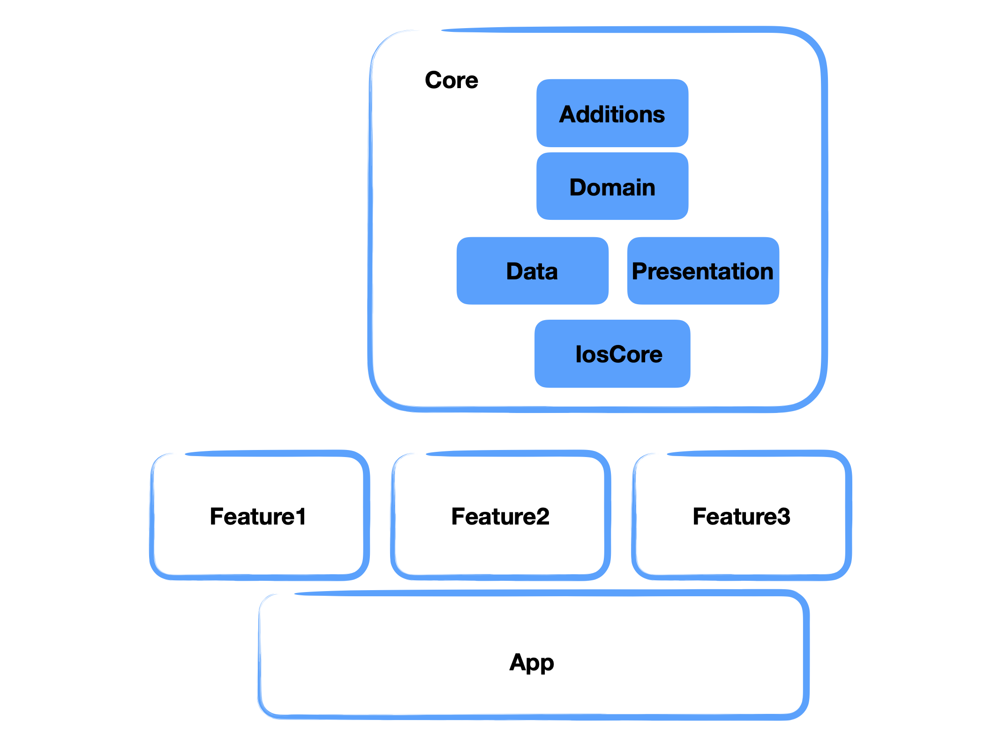

## High level architecture & contribution guide

### SOLID, Protocols, TDD, VIPER 
- [This should be your bible](https://hackernoon.com/solid-principles-made-easy-67b1246bcdf)

- Provides a clear separation of conerns, giving way to scalable code. A feature doesn't necessarily require all of the stack components if it doesn't make sense. It might be that a component doesn't require a view, another doesn't require an interactor. It might be the case that a view requires two presenters (reusing one from a similar feature through composition) and it might be that a presenter requires 5 use cases, as such, 5 interactors. These can be then reused in other screens. See examples in Profile.

- **Rule of thumb** 1: Whenever you think you need a new component, first write a protocol. Makes youre thinking cleaner. Ask yourself, how would you test it? Write a test that can only call the protocol's methods. Don't expose anything more.

- **Rule of thumb 2**: Always start from the domain layer. Think about your feature as a command line tool. It has to be called from the command line in a simple fashion, and should be able to print out the result.

- **Rule of thumb 3**: High level modules should not depend upon low level modules. Both should depend upon abstractions. Domain layer should never import Data, or Presentation, but declare its collaborating protocols. Data and Presentation should always implement these. Applies to IosCore, Profile, etc..

- **Rule of thumb 4**: UI components should never know what features they serve. A Cell or a label should not only server Profile or Channels. Instead, the ViewController can declare extensions of the UI Components that adapt it to a protocol declared by the presentation.

- **Rule of thumb 5**: ViewController should not ever contain any information that it presents, neither the cell. NONE!

- **Rule of thumb 6**: Last but not least. Write a damn test after that protocol will ya? 

    Ex.: Presenter declares the protocol it requires to display a piece of information (a person in a list). View dequeues a cell conforming to this protocol and passes it to the presenter. Cell is abstract, but VC extends it to conform to this protocol. Cell has it's own data model that requires Data for image, String for titles, etc. Use separete cell data models for information arriving in discrete moments. One model for strings, another for error, another for images. Blocks for actions should be assigned separately. 

    This ensure that until the Presentation layer there is no need to know about UIKit, and all domain data stays above the ViewController.

    If we have to deploy to a new architecture, only IosCore needs to be duplicated for TvOS or WatchOS.

### Routers, Coordinators and Routing
- Routers serve their purpose as known in VIPER: starting the feature and managing the navigation stack. Creating new features.
- What about deep linking? Every router implements 'Routing' to know about it's children. As such a network of routers provide a tree of responders who can each declare wheather they or their children are able to respond to deep links.
- Also, all routers know about their parents. If a message needs to passed up the chain to a specific protocol, the router tree can do that.
- Dependency injection is done via Modules. A Module would normally require a host to route on, while returning it's router and  ViewController. The next Router has to be added to the calling router's children once it's started. 

### Style
- IosCore framework describes a styling protocol. Reusable components in here will try to infer some these styles and decorate themselves accordingly. 

- Implementation is provided in the app layer, as such every new client can have it's own style description.

### The need for frameworks.

Perhaps the first requirement is scalability. How many times have you seen a project become anightmare to maintain because of tech debt. As engineers we have to aim at creating easily scalable and supportable codebase.

Not respecting the above guidilenes is very easy, and deviating from it leads down the road where it's difficult to recover the tech debt. Keep on top of it!

### Core
- Additions
Syntax sugar

- Domain

        Business models and interactors. 
        Protocols collaborating with interactors

- Data

        Networking
        Persistence
        parsers for the above 
        service endpoints descriptions
        
- Presentation

        General non domain logic goes here.
        Abstraction for error & camera Routing and interaction presentation.
        App Presentation for startup and app lifecycle

        
### IosCore
        Routing implementation, App Router
        Default Error and Dialog presentation
        UIKit extensions
        Image Editor
        Notifications Displaying
        Style
        Reusable components
        
        
### Dependencies
        
- photo picker library    
        
        github "tilltue/TLPhotoPicker"
    
- persistence storage and used for reactive programming  

        github "realm/realm-cocoa"
    
- secure storage

        github "evgenyneu/keychain-swift"

- easy customisation of constraints

        github "SnapKit/SnapKit"

- image handling

        github "onevcat/Kingfisher"
    
- parsing JWT Tokens

        github "auth0/JWTDecode.swift"
                
### Feature frameworks

- all features should go into framworks that don't know about each other.
- bespoke feature implementations go here

        ViewControllers
        Presenters
        Routers (Coordinators)
        Modules for Dependency injection

## Conventions
### Protocols and implementations
    
Protocols should be called *ing:
    
    "-Routing", "-Persisting", "-ProfileFetching", "-UserBlocking", etc.. 
    
Implementations should follow the -er convention:
        
     "-Router", "-Fetcher", "-Interactor", "-Presenter", etc..
